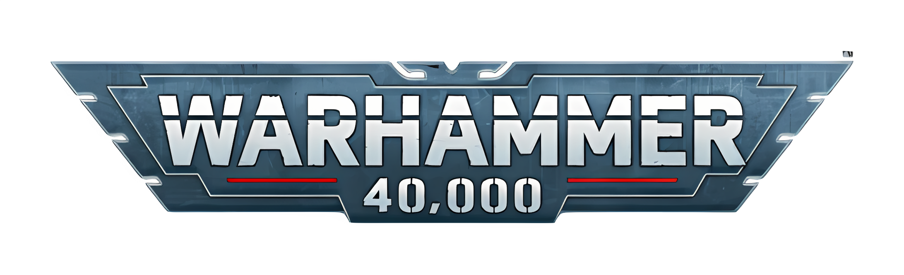

# ☠️ Warhammer 40K API

> ⚠️ **Nota:** Este proyecto está en desarrollo activo y aún se encuentra en construcción. Las funcionalidades pueden cambiar y no todo está implementado todavía.

Una API pública escrita en **Node.js + Express + TypeScript**, pensada para consultar información del universo de **Warhammer 40,000**: facciones, unidades, armas, personajes y mucho más.

---

---

## 🚀 Funcionalidades previstas

- ⚔️ Consulta de facciones, personajes, regiones y eventos
- 🔫 Información sobre unidades, habilidades, armas y estadísticas
- 📖 Acceso estructurado al lore (trasfondo narrativo)
- 🔎 Filtros por tipo, rol, facción o keywords
- 🌐 API RESTful documentada y fácil de integrar

---

## 🧪 Stack técnico

| Tecnología     | Descripción                                         |
| -------------- | --------------------------------------------------- |
| **TypeScript** | Tipado estático para mayor robustez y escalabilidad |
| **Express 5**  | Framework web backend para Node.js                  |
| **MongoDB**    | Base de datos NoSQL para estructura flexible        |
| **Mongoose**   | ODM para modelar datos y validar esquemas           |
| **Zod**        | Validaciones de entrada basadas en TypeScript       |

---

## 📦 Instalación (próximamente)

Una vez se complete la base funcional, se documentará el proceso de instalación y uso local de la API.

---

## 📄 Licencia

Este proyecto está licenciado bajo la licencia MIT.

---

## ✝️ Y recuerda, El Emperador Protege 🫡🫡🫡

